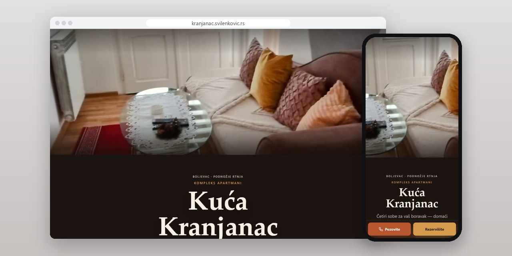
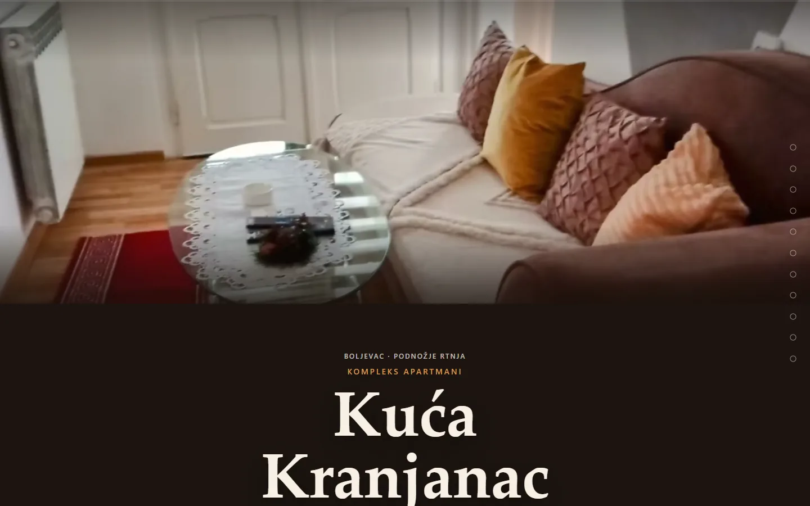
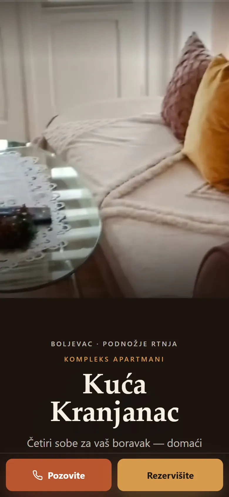
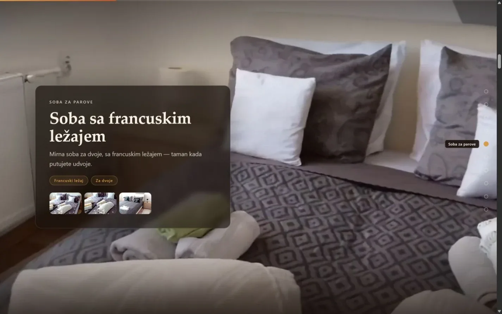
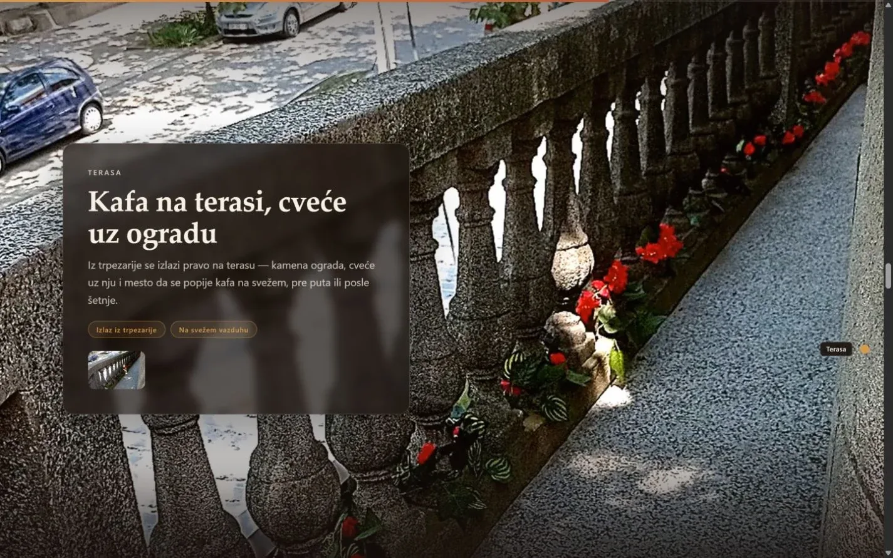

# Kuća Kranjanac

One-page site in Serbian and English for a guest house below Mount Rtanj, with a scroll-driven film that walks visitors through the house.

**[kranjanac.svilenkovic.rs](https://kranjanac.svilenkovic.rs/)** · [Case study (in Serbian)](https://svilenkovic.com/radovi/kuca-kranjanac) · [Srpski](README.sr.md)

> [!NOTE]
> Client project. The source code belongs to the client and stays in a private repository. This page describes what I built and how.

<table>
  <tr><td><b>Client</b></td><td>Kuća Kranjanac</td></tr>
  <tr><td><b>Industry</b></td><td>Guest rooms in a family house</td></tr>
  <tr><td><b>Location</b></td><td>Boljevac, Serbia</td></tr>
  <tr><td><b>Type</b></td><td>One-page bilingual website</td></tr>
  <tr><td><b>My role</b></td><td>Design, development, SEO, hosting and maintenance</td></tr>
  <tr><td><b>Stack</b></td><td>HTML, CSS, JavaScript, PHP</td></tr>
</table>

## About the project

Kuća Kranjanac is a family house in Boljevac, 10 km from Mount Rtanj, with four rooms, a kitchen with a dining room, a terrace and a yard with a grill, all booked directly with the host. The house makes most sense when you see it in the order a guest walks through it. So the page works as a guided tour first and only then shows prices and the inquiry form.

The tour is a film cut into chapters: entrance, living corner, stairs, rooms, kitchen, terrace and yard. Each scroll gesture glides to the next chapter, and the footage actually plays through the transition and stops on that chapter's scene. A video cannot play backwards, so scrolling up jumps just ahead of the target and plays forward into it. Phones held upright get their own set of frames, composed for a tall screen so the rooms are not cropped, and if the video cannot play at all, an image sequence takes its place.

## What I built

- Serbian and English versions with the same layout and photos, linked with hreflang
- Separate chapter positions for desktop and mobile, since the scroll track has a different height on each
- The video starts loading at the first idle moment or the first gesture, so it does not fight the poster and styles for bandwidth
- A short clip the host filmed herself, a room table with prices on request and a small FAQ
- An inquiry form for arrival and departure dates and the number of guests, with a trap field for bots

## Results

| | Performance | Accessibility | Best practices | SEO |
| :-- | :-: | :-: | :-: | :-: |
| Mobile | 100 | 100 | 96 | 100 |
| Desktop | 100 | 100 | 100 | 100 |

PageSpeed Insights, lab test of the live site, September 2026. Security headers: 6 of 6. HTML validator: no errors. axe accessibility check: no violations. Structured data: `FAQPage`, `LodgingBusiness`, `VideoObject`.

## Screenshots

<table>
  <tr>
    <td width="68%" valign="top"></td>
    <td width="32%" valign="top"></td>
  </tr>
</table>

A chapter of the tour, with the room for couples

The terrace, shown with a photo and a short description of the space

---

Built by [D. Svilenković](https://svilenkovic.com).
